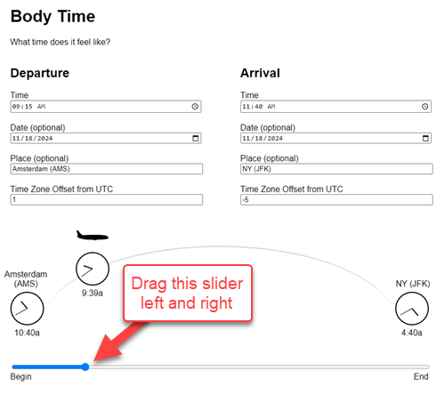

# Body Time

Body Time is an app that demonstrates the practical time felt by the body as you travel from one time zone to another. The slider at the bottom lets you control the duration of the trip so far. As the slider at the bottom moves, the "In Transit" clock above the slider travels from left to right along the arc.

Try it out here: [Body Time](https://gulley.github.io/Bodytime/).

For more information, see [Body Time – Talking to the Time Minder](https://starchamber.com/2024/09/10/body-time-talking-to-the-time-minder/).
