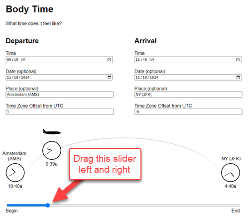

# Body Time

Body Time is an app that demonstrates the practical time felt by the body as you travel from one time zone to another. The slider at the bottom lets you control the duration of the trip so far. As the slider at the bottom moves, the "In Transit" clock above the slider travels from left to right along the arc.

Enter an airport code (e.g. `AMS`, `JFK`) to fill in the place and its time zone offset automatically, including daylight saving time for the date you choose. Airport data comes from [OurAirports](https://ourairports.com/data/) and time zones from [mwgg/Airports](https://github.com/mwgg/Airports).

On an actual flight, switch to **Live GPS** and the slider follows your position between the two airports. GPS works in airplane mode. Open the page once before you board: it saves your trip and works offline after that. A window seat helps the phone get a fix.

To rebuild the airport data, run `python tools/build_airports.py`.

Try it out here: [Body Time](https://gulley.github.io/Bodytime/).

For more information, see [Body Time – Talking to the Time Minder](https://starchamber.com/2024/09/10/body-time-talking-to-the-time-minder/).
